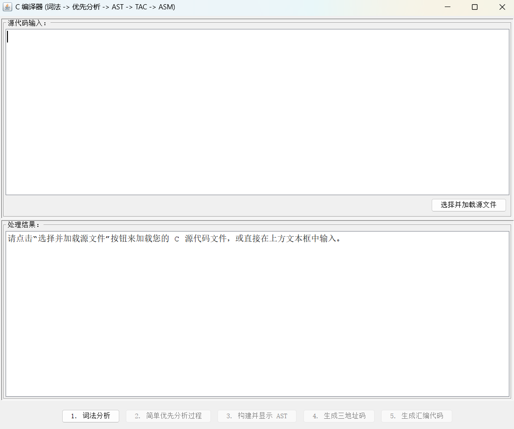

# 简易 C 语言编译器（Java 实现）

## 📌 项目简介

本项目是一个使用 Java 实现的简易 C 语言编译器，演示完整的编译流程：**词法分析、语法分析（简单优先法与递归下降法）、抽象语法树（AST）构建、三地址码（TAC）生成**以及**x86 汇编代码输出（兼容 DOS 环境）**。支持**图形用户界面（GUI）** 和**命令行界面（CLI）** 两种操作方式。

---

## 🚀 功能特性

### ✅ 支持的 C 语言子集

* **数据类型**：`int`
* **主函数**：`int main() { ... }`
* **变量声明与初始化**：`int a;`、`int b = 10;`
* **表达式与赋值**：`a = b + 2;`
* **运算符**：

    * 算术运算：`+`、`%`
    * 关系运算：`<=`、`==`（部分实现 `<`, `>`, `>=`, `!=`，参考 `AssemblyGenerator.java`）
* **控制结构**：

    * 条件语句：`if (...) { ... } else { ... }`
    * 循环语句：`while (...) { ... }`
* **输出语句**：

    * `printf("%d", var);`
    * `printf("string\n");`
* **返回语句**：`return expression;`

### 🧩 编译器工作流程（图形展示）


1. 词法分析
2. 简单优先语法分析
3. AST 构建
4. TAC（三地址码）生成
5. x86 汇编代码生成（TASM/MASM 可用）

---

## ⚙ 技术栈

| 项目      | 内容     |
| ------- | ------ |
| 开发语言    | Java   |
| 构建工具    | Maven  |
| Java 版本 | JDK 23 |
| 编码格式    | UTF-8  |

---

## 📁 模块结构概览

### 1. Lexer（词法分析器）

* **路径**：`Lexer/Lexer.java`, `Lexer/Token.java`
* 作用：将源代码分解为 Token 序列，识别关键字、标识符、常量、运算符、分隔符等。

### 2. Parser（语法分析器）

* **简单优先分析**：`Parser/SimplePrecedenceParser.java`、`Parser/GrammarRule.java`
* **递归下降解析（构建 AST）**：`AST/RecursiveDescentASTParser.java`

### 3. AST（抽象语法树）

* 定义各类节点：如 `ProgramNode`, `IfNode`, `WhileNode`, `AssignmentNode` 等。
* 每个节点可生成 TAC（`generateTAC`）并支持树形结构输出（`printTree`）。
* TAC 上下文管理类：`TACContext.java`

### 4. 汇编生成器（AssemblyGenerator）

* **路径**：`AssemblyGenerator/AssemblyGenerator.java`
* 将三地址码翻译为 x86 汇编，支持栈帧、条件跳转、整数输出等。

### 5. 用户界面

* **GUI（Swing 实现）**：`GUI/MainGUI.java`
* **CLI**：`Main.java`，读取文件、执行编译流程并输出结果。

---

## 🧪 示例输入代码（example.txt）

```c
int main() {
    int i = 0;
    int s = 50;
    while (i <= s) {
        i = i + 3;
    }
    printf("%d", i);
    if (i % 2 == 0) {
        printf("Even Number");
    } else {
        printf("Odd Number");
    }
    return 0;
}
```

⚠️ 注意：`printf` 会在输出后自动添加换行（由汇编生成器处理）。

---

## 💻 使用说明

### 1. 环境准备

* 安装 [JDK 23+](https://jdk.java.net/23/)
* 安装 [Apache Maven](https://maven.apache.org/)
* （可选）用于执行汇编代码：

    * DOS 模拟器：如 [DOSBox](https://www.dosbox.com/)
    * 汇编器：TASM 或 MASM

### 2. 构建项目

```bash
mvn clean package
```

构建后将在 `target/` 生成可执行 JAR 包：`CCompiler-1.0-SNAPSHOT.jar`

### 3. 运行编译器

#### 📍 GUI 模式

```bash
java -jar target/CCompiler-1.0-SNAPSHOT.jar
```

操作流程：

1. 启动时尝试加载 `example.txt`
2. 依次点击按钮完成五个编译阶段
3. 生成的汇编代码可保存为 `.asm` 文件（默认 `output.asm`）

#### 🧾 CLI 模式

可直接运行 `Main.java`，或手动配置文件路径并运行：

```bash
java Main
```

编译所有阶段并输出至控制台。

### 4. 汇编 & 执行程序（在 DOS 环境中）

```dos
TASM output.asm
TLINK output.obj
output.exe
```

---

## 📚 文法参考

* **简单优先文法**：见项目文件 `Parser.md`
* **递归下降文法**：定义于 `RecursiveDescentASTParser.java` 中的各解析函数，如 `parseProgram()`、`parseBlock()` 等。

---

## 📦 配置文件说明

| 文件/目录        | 说明                 |
| ------------ | ------------------ |
| `pom.xml`    | Maven 构建配置文件       |
| `.idea/`     | IntelliJ IDEA 工程配置 |
| `.gitignore` | 忽略 IDE、构建缓存等非代码文件  |

---

